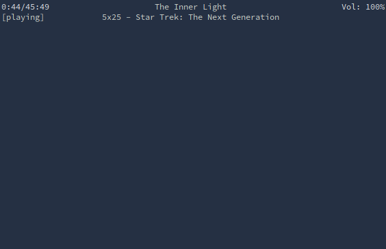

# bkcpp



## ncmpcpp:mpd::bkcpp:kodi

Brick Kodi Client Plus Plus

The goal of this application is to be feature comparable to ncmpcpp.
Playlist/now playing view, video library browser, music browser.

This application is very much in development.

Feel free to open issues to comment on the code or request features.  

### Installation
Requires stack and assumes a Linux environment.

```
git clone https://github.com/CharlesSchimmel/bkcpp
cd bkcpp
stack install
```

### Usage

```
Usage: bkcpp (-a|--ip-address ip) [-p|--port port] [--username user]
             [--password pass] [-y|--youtube yt]
  Brick Kodi Client Plus Plus - A TUI Kodi Interface

Available options:
  -a,--ip-address ip       IP address of running Kodi Media Center
  -p,--port port           Port - 8080 if you haven't changed it (default: 8080)
  --username user          Username (not usually set)
  --password pass          Password (not usually set)
  -y,--youtube yt          YouTube url to cast
  -h,--help                Show this help text
```

Keyboard movement is largely the same as the [default Kodi keyboard
controls](https://kodi.wiki/view/Keyboard_controls) with the exception of `hjkl`
being used for directional navigation.
